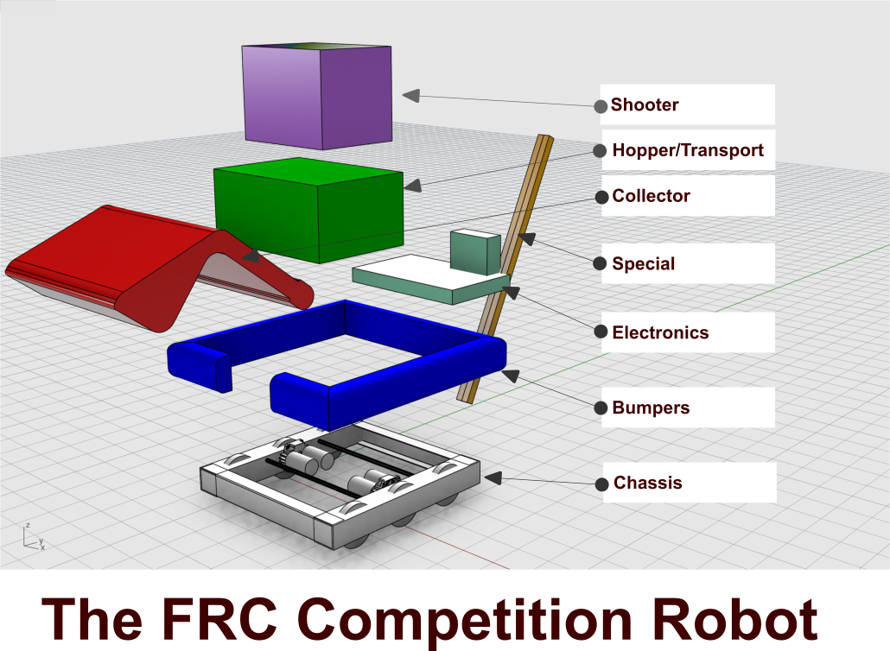

## Robot Sub-system Layout {#robot-sub-system-layout}

There are common sub-subsystems that make up an FRC robot. Based on the game each year each of these systems take on a different importance and complication. And while each of these systems can be viewed separately, each systems relates to and affects the other systems.

1.  **Chassis/Drivetrain** - The chassis drivetrain is the rigid base. Everything else is built up from this. It needs to be deep (for strength), rigid and supportive. Making a drivetrain that is strong and consistent is very important. The standard Kit of Parts will contain a standard drive base using a traditional “West Coast Drive” (3 wheels each side with the center wheel ⅛” lower). The West coast drive is a very good general purpose drive configuration. If the team decides not to use a standard drive base, be aware that the design and fabrication of a consistent drivetrain is complicated. Do not take it lightly when deciding to fabricate your own. Also be aware of the extra work that software or electrical may have to do if the drivetrain is not standard.
2.  **Superstructure** - This is the rigid structure that ties everything together. It is bolted to the Chassis. It need to support the bumper connection. We use a Dual Rail concept to support. Dual rail concept in most cases. This is to support mechanical axles. So instead of one row of structure, think about always having two rails to allow structural support. Both sides of wheels on chassis for instance.
3.  **Bumpers** - These are required on every robot to protect the robots from each other and the field during competition. These should be the second thing the team designs! While normally they cannot vary in shape, they normally can vary in height on the robot. The bumper color specifies the alliance a robot is during the game. So, bumpers must be able to change from red to blue between matches. The process in this handbook uses a velcro quick change system that has proved very practical. Build the bumpers early and carefully. Normally bumpers are ¾” plywood with 2.5” pool noodles bolted to the robot. It is terrible to have to change bumper construction at a competition because of an overlooked rule. It is also important to note that bumpers normally need to be removed for inspection and weigh in. This happens at least twice during a competition. The bumper rules state You need to use 3/4&quot; plywood and that the rest of the attachments to the robot must fit within 1&quot; including the plywood. This means you are limited to bolts thru the plywood. But, you can use the bolts to attach quick connect setup to the bumpers. These quick connects are technically part of the robot. So for weighing, we would leave quick connects on the robot. Therefore are not measured as part of the robot and are not within the 1&quot;. If you have duplicate pieces of the disconnects, then you can simply put them on for weigh in.
4.  **Collector/Intake** - The collector is used to bring a game piece into the robot’s control. Normally this is done by picking up the game piece(s) from the field. Normally this is a roller arm or claw mechanism. Many times the collector will need to extend outside the perimeter of the robot. This can expose it to hits and damage from other robots and the field. Make it strong, but also build in a little flexibility to avoid permanent damage during the rigors of the game. Using Polycarbonate plastic in its constructions is a good way to build in flexibility to avoid permanent deformation of the collector mechanism.
5.  **Transport/Hopper** - Once gaining control of the game piece, it probably needs to be held or moved to the shooter. If there are just a few game pieces, this might be a small area. If there are many game pieces, the hoppe might be a large container. Gamepieces must be actively engaged. So always have a way to actively move a game piece. For instance a large hopper there must be an agitator to remove all game pieces. Never leave pieces to simple gravity to move, they will jamb or not act the way you expect all the time.
6.  **Shooter** - Shooting/placing a gamepiece for a score takes a “shooter” A shooter make take the form of a catapult, wheeled ball shooter, an extension arm, a lift arm, a kicker or even a dumping mechanism. The layout of the scoring area and properties of the gamepiece will dictate the type of shooter required for each game. Consistency and repeatability is key here. Remember that gamepeice may wear or permanently deform during a competition. Design to account for the possible changes to the gamepieces due to the rigors of the game.
7.  **Specialised** - The Gamemakers will normally include a specialized task in the game that can tip a close match in your favor. This task can be quite different than the other parts of the game. The Specialized task might be capturing extra gamepieces, climbing, balancing or some other task to gain points during or after the game. Designing this system can happen independently of the rest of the robot and may not be working for the first competition of the season. Be aware, a task like this left to the end of the design, without any account in the design, there may not work. Start working on this system early, while it may not be added until a couple competitions into the season, it is important to work on this.
8.  **Electronics/Pneumatics** - There is a set of standard electronics and a battery that are needed to compete. Plan room for them. The electronics can be mounted horizontally, vertically or on multiple levels, but plan for them. Make sure they have enough room to fit.