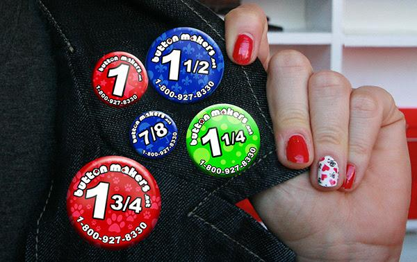

## Buttons {#buttons}

There is a significant price savings if we go with the 1 3/4&quot; button. The 1-¾” is much smaller than most buttons, but that made them a little cool.

At the first district event of the season we handed out 200 buttons went in 2 hours for a 28 team district event. It seemed a little short. The second district event we ordered 500\. We had around 100 left after the event. Interest seemed to be a little less during the second event.

For 1.75 bought button is about 0.40 per button. For make it yourself it is about 0.15 per button with our button machine. You can rent button machines and paper cutters.

The Button supply and making place is :

**Button Makers in Seattle.**

[**http://buttonmakers.net/**](http://buttonmakers.net/)

**Pricing:**

_________________________________________________________________________________________

**Setup Fees:**

.................................................................................................

| Setup First Image | $10.00 |
| --- | --- |
| Setup Each Additional Image / Size | $2.00 each |

**Small Size Pinned Back Buttons:**

7/8&quot;, 1&quot;, 1-1/4&quot;, 1-1/2&quot;, 1-3/4&quot;

.................................................................................................

| 1-24 | $1.00 each |
| --- | --- |
| 25-49 | $0.60 each |
| 50-199 | $0.50 each |
| 200-499 | $0.40 each |
| 500-999 | $0.35 each |
| 1,000-9,999 | $0.30 each |
| 10,000 + | $0.25 each |