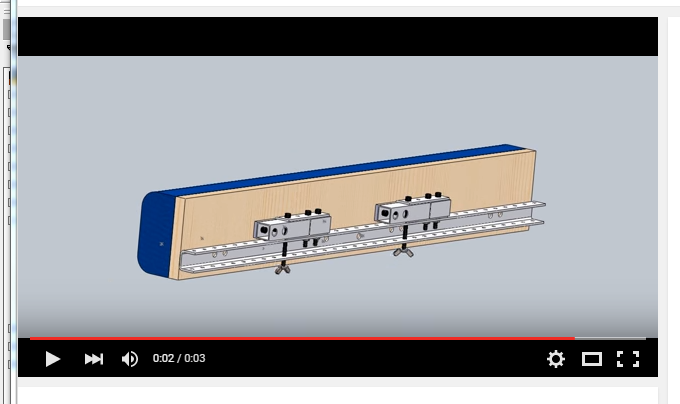

## Attaching bumpers {#attaching-bumpers}

Being able to quickly remove and attach the bumpers to the robot is important. It is necessary do it a number of times during competitions. The bumper rules are very specific about depth. So it is difficult to officially have anything attached to the bumpers but a simple bolt.

But we have learned that there is a trick to this. Use the bolt to attach a quick fitting to the bumpers, then quick fit the bumpers to the robot. Officially the quick fittings will belong to the robot and must be weighed with the robot. This allows a wide array of possible fittings.

A good example of a system with quick fits: [https://www.youtube.com/watch?v=Ga_EettJrbM](https://www.youtube.com/watch?v=Ga_EettJrbM)

*   Extension from front of treds, fits into backing to secure from movement
*   Secure the bottom of the bumpers to the chassis
    *   downward
    *   from front and back
*   pellon - numbers
*   Reversible bumper
    *   how to vid: [https://www.youtube.com/watch?v=BUDMB-aiBpo](https://www.youtube.com/watch?v=BUDMB-aiBpo)
    *   bumper mount: [https://www.youtube.com/watch?v=Ga_EettJrbM](https://www.youtube.com/watch?v=Ga_EettJrbM)
    *   bumper skirt: [http://www.robopromo.com/product_p/rp-2008.htm](http://www.robopromo.com/product_p/rp-2008.htm)
    *   bungee: [https://www.youtube.com/watch?v=XYTiRxLw7oA](https://www.youtube.com/watch?v=XYTiRxLw7oA)
    *   Reversible 90° corner: [http://www.firstroboticscanada.org/main/wp-content/uploads/kbotics-reversible-bumper.pdf](http://www.firstroboticscanada.org/main/wp-content/uploads/kbotics-reversible-bumper.pdf)
    *   red nylon: [http://www.ebay.com/itm/CORDURA-SCARLET-RED-1000D-WATER-REPELLENT-OUTDOOR-FABRIC-60-COATED-DWR-CORDURA-/281915852478?hash=item41a37e86be:g:tzsAAOSw3ydV2zX4](http://www.ebay.com/itm/CORDURA-SCARLET-RED-1000D-WATER-REPELLENT-OUTDOOR-FABRIC-60-COATED-DWR-CORDURA-/281915852478?hash=item41a37e86be:g:tzsAAOSw3ydV2zX4)
    *   blue velcro: [http://www.amazon.com/gp/product/B00QJ02GOI?pldnSite=1](http://www.amazon.com/gp/product/B00QJ02GOI?pldnSite=1)
    *   red velcro: [http://www.amazon.com/gp/product/B00QJ02GOI?pldnSite=1](http://www.amazon.com/gp/product/B00QJ02GOI?pldnSite=1)
    *   blue nylon: [http://www.ebay.com/itm/ROYAL-BLUE-1000D-OUTDOOR-FABRIC-60-W-CORDURA-NYLON-CORDURA-WATER-REPELLANT-/301853886133?hash=item4647e4c6b5:g:yNYAAOSwT6pV2zYX](http://www.ebay.com/itm/ROYAL-BLUE-1000D-OUTDOOR-FABRIC-60-W-CORDURA-NYLON-CORDURA-WATER-REPELLANT-/301853886133?hash=item4647e4c6b5:g:yNYAAOSwT6pV2zYX)
    *   nylon seattle fabrics: [https://co01.justaddcommerce.net/o/order.dll?jac=T3JkZXIgQ2hlY2tvdXQ-&amp;mer=MDAwMS01Mzc4LTY1NzMtNzIzNw--&amp;url=aHR0cDovL3d3dy5zZWF0dGxlZmFicmljcy5jb20vbnlsb25zLmh0bWw-](https://co01.justaddcommerce.net/o/order.dll?jac=T3JkZXIgQ2hlY2tvdXQ-&mer=MDAwMS01Mzc4LTY1NzMtNzIzNw--&url=aHR0cDovL3d3dy5zZWF0dGxlZmFicmljcy5jb20vbnlsb25zLmh0bWw-)
*   noodle welding
    *   [https://www.youtube.com/watch?v=agj6Uw5aFTg](https://www.youtube.com/watch?v=agj6Uw5aFTg)

*   material needed
    *   SideK32
        *   ¾ (2) 5x7.25
        *   ¾ (2) 30.5x2
        *   ¾ (2) 31.25x5
        *   ½ (8) 1.25x4
        *   ½ (8) 3.75x4
    *   SideK29
        *   ½ (4) 1.25x4
        *   ½ (4) 3.75x4
        *   ¾ (1) 29.5x5
    *   Total
        *   ½ 240 in2  (round to 300)
            *   60x50in?
        *   ¾ 654.5 in2  (round to 700)
            *   20x35in?
*   TOTAL CALCS 54inx3yrds